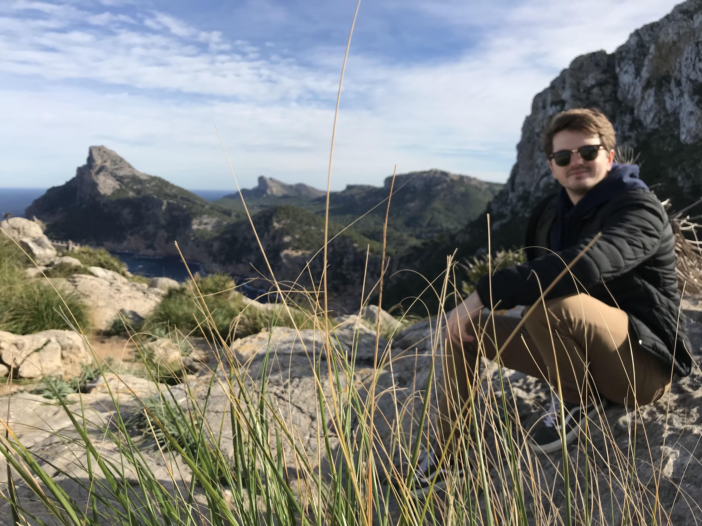

**Lewis A. Jones, PhD**  
**Postdoctoral Research Fellow**  
Mapas Lab, Centro de Investigación Mariña, Universidade de Vigo
[LewisAlan.Jones@uvigo.es](mailto:LewisAlan.Jones@uvigo.es)

{width=100%}

I am a **computational palaeobiologist** investigating the drivers of biodiversity patterns across a range of temporal and spatial scales. My research primarily focuses on the co-evolution of life and the environment, and evaluating the influence of data incompleteness on our perceptions of the geological past. To do so, I integrate a range of interdisciplinary tools and sources of information, such as **ecological niche modelling, fossil occurrence data, and palaeoclimatic models** to estimate species' distributions in deep time. I am currently a Postdoctoral Research Fellow in the **[Mapas Lab](https://paleobiogeography.org)** at the University of Vigo, where I study the **constraints and drivers of spatial biodiversity patterns** in the fossil record.

To date, my research has primarily focused on marine invertebrates and ecosystems, particularly **scleractinian corals and warm-water coral reefs**. I also collaborate with numerous fantastic researchers on projects related to the **[non-avian dinosaurs](https://alessandrochiarenza.weebly.com)**, **[mammals](https://www.mirantakouvari.com)**, and **[palaeoclimate](https://keichenseer.netlify.app/)**, check them out!

*If you are interested in joining our lab, please feel free to get in contact. We will periodically advertise opportunities for student projects, and we welcome researchers wanting to do a short stay.*

**Research Interests**

Analytical palaeobiology, macroecology and biodiversity, fossil record bias, corals and reef ecosystems, palaeoclimate, ecological niche modelling, and R programming.

