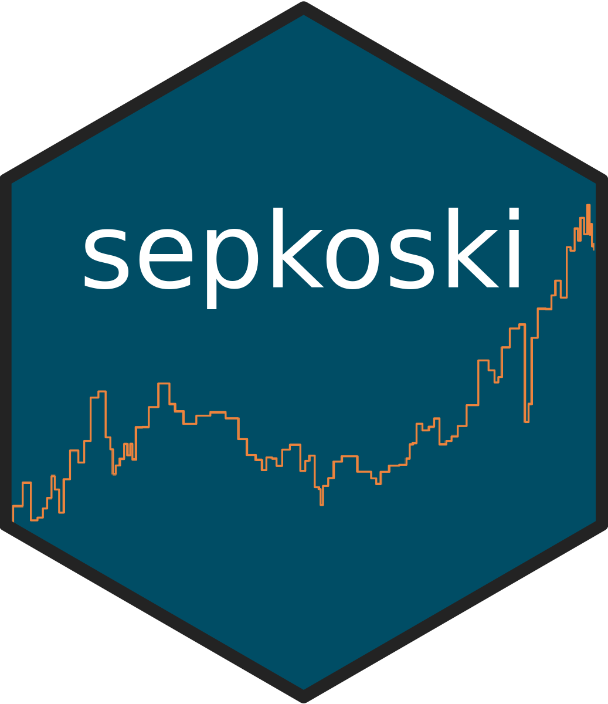

### <a href="https://palaeoverse.org" style="text-decoration: none;">palaeoverse</a> 

The palaeoverse R package is a community-driven toolkit to support the preparation and exploration of palaeobiological data. The package provides a suite of auxiliary functions, is open-source, and freely available from the <a href="https://cran.r-project.org/web/packages/palaeoverse/index.html" style="text-decoration: none;">CRAN</a>. palaeoverse has three core principles: (1) streamline data preparation and exploration; (2) enhance code readability; and (3) improve reproducibility of results. It is my hope that over time, palaeoverse will be adopted and developed by the community, with contributors and users from across the globe.

{width=15%}

### <a href="http://sepkoski.palaeoverse.org" style="text-decoration: none;">sepkoski</a> 

The sepkoski R package is a light and easy solution to access Sepkoski's fossil marine animal genera compendium. The package provides access to the raw dataset, a dataset with intervals standardised to the International Geological Time Scale, and plotting functionality for reproducing Sepkoski's Phanerozoic curve. The package is open-source, and freely available from the <a href="https://cran.r-project.org/web/packages/sepkoski/index.html" style="text-decoration: none;">CRAN</a>.

{width=15%}